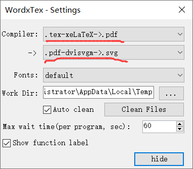

LaTeXIO is forked from [WordxTex](https://github.com/rylandev/WordxTex) 。 

# dev
推荐使用VS2017进行开发。

1）下载下来代码
```bash
git clone xxx --recursive
```
2) 可以自动安装所需的开发环境 `Visual Studio 2010 Tools for Office Runtime`。
或者自行下载[Visual Studio 2010 Tools for Office Runtime](https://link.zhihu.com/?target=https%3A//www.microsoft.com/en-us/download/details.aspx%3Fid%3D48217)

3） 安装到office word 后，可以在加载项中看到LaTeXIO，并进行如下设置：



# 问题与解决

* 如何调试，尚不清楚。

* office 365 上面是灰色的，无法使用。 

  已经解决，需要安装 texlive, 并将类似的
  `xxx\LaTeX\soft_texlive_2021\texlive\2021\bin\win32` 路径加入到 windows的系统环境变量中去。


# REF
https://zhuanlan.zhihu.com/p/126710209